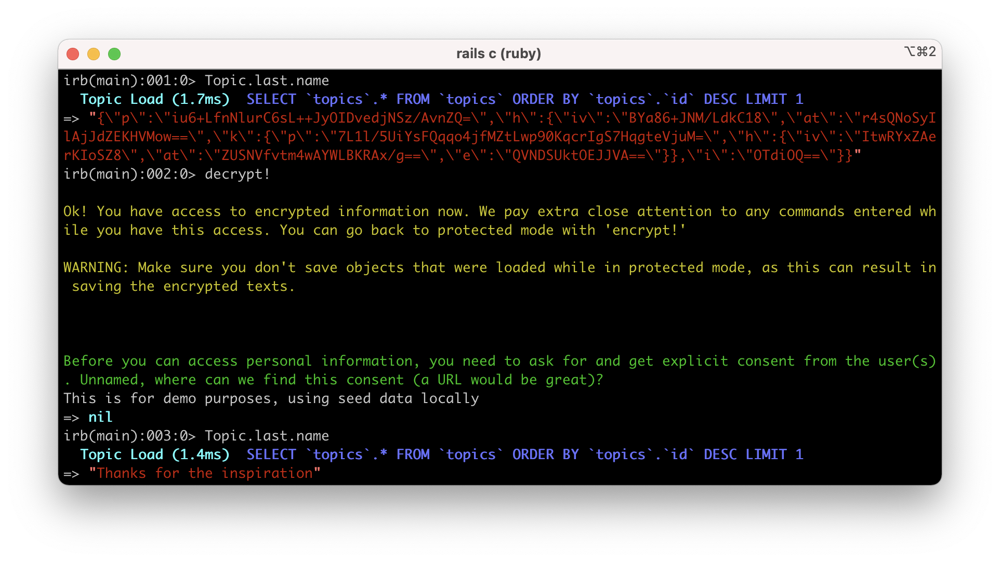
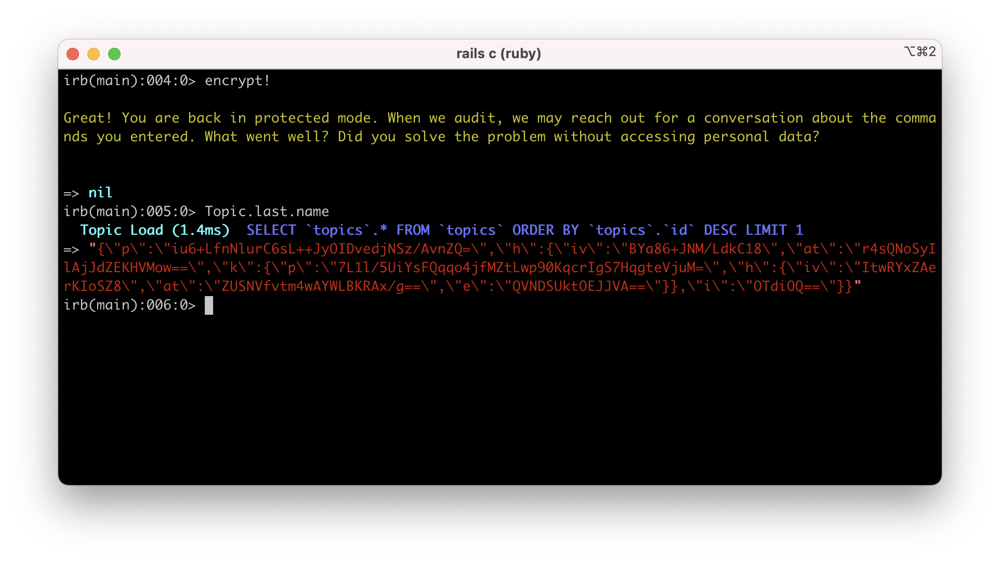
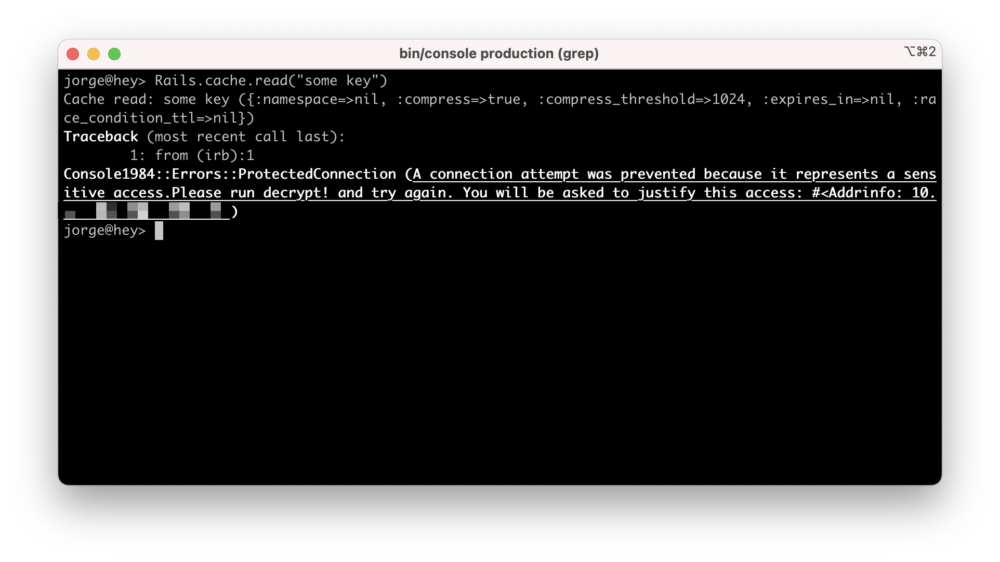

# Console1984

A Rails console that protects sensitive accesses and makes them auditable.

> “If you want to keep a secret, you must also hide it from yourself.”
>
> ― George Orwell, 1984

If you are looking for the auditing tool, check [`audits1984`](https://github.com/basecamp/audits1984).

## Installation

Add it to your `Gemfile`:

```ruby
gem 'console1984'
```

Create tables to store console activity in the database:

```ruby
rails console1984:install:migrations
rails db:migrate
```

By default, console1984 is only enabled in `production`. You can configure the target environments in your `application.rb`:

```ruby
config.console1984.protected_environments = %i[ production staging ]
```

## How it works

### Session activity logging

When starting a console session, it will ask for a reason. Internally, it will use this reason to document the console session and record all the commands executed in it.


### Auditing sessions

Check out [`audits1984`](https://github.com/basecamp/audits1984), a companion auditing tool prepared to work with `console1984` database session trails.

### Access to encrypted data

By default, `console1984` won't decrypt data encrypted with [Active Record encryption](https://edgeguides.rubyonrails.org/active_record_encryption.html).

To decrypt data, enter the command `decrypt!`. It will ask for a justification, and these accesses will be flagged internally as sensitive.



You can type `encrypt!` to go back to protected mode again.



While in protected mode, you can't modify encrypted data, but can save unencrypted attributes normally. If you try to modify an encrypted column it will raise an error:



### Access to external systems

While Active Record encryption can protect personal information in the database, are other systems can contain very sensitive information. For example: Elasticsearch indexing user information or Redis caching template fragments.

To protect the access to such systems, you can add their URLs to `config.console1984.protected_urls` in the corresponding environment config file (e.g: `production.rb`):

```ruby
config.console1984.protected_urls = [ "https://my-app-us-east-1-whatever.us-east-1.es.amazonaws.com", "redis://my-app-cache-1.whatever.cache.amazonaws.com:6379" ]
```

As with encryption data, running `decrypt!` will let you access these systems normally. The system will ask for a justfication and will flag those accesses as sensitive.

This will work for systems that use Ruby sockets as the underlying communication mechanism.

## Configuration

These config options are namespaced in `config.console1984`:

| Name                     | Description                                                  |
| ------------------------ | ------------------------------------------------------------ |
| `protected_environments` | The list of environments where `console1984` will act on. Defaults to `%i[ production ]` |
| `protected_urls`         | The list of URLs corresponding with external systems to protect. |
| `session_logger`         | The system used to record session data. The default logger is `Console1984::SessionsLogger::Database`. |
| `username_resolver`      | Configure an object responsible of resolving the current database username. The default is `Console1984::Username::EnvResolver.new("CONSOLE_USER")`, which returns the value of the environment variable `CONSOLE_USER`. |

## About built-in protection mechanisms

`console1984` uses Ruby to add several protection mechanisms. However, because Ruby is highly dynamic, it's technically possible to circumvent most of these controls if you know what you are doing. We have made an effort to prevent such attempts, but if your organization needs bullet-proof protection against malicious actors using the console, you should consider additional security measures.

