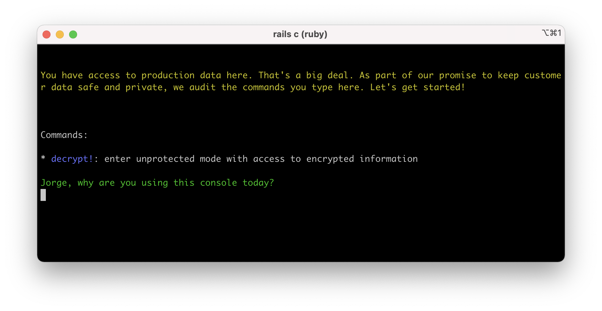

# Console1984

A Rails console extension that protects sensitive accesses and makes them auditable.

> “If you want to keep a secret, you must also hide it from yourself.”
>
> ― George Orwell, 1984

If you are looking for the auditing tool, check [`audits1984`](https://github.com/basecamp/audits1984).



## Installation

**Important:** `console1984` depends on [Active Record encryption](https://guides.rubyonrails.org/active_record_encryption.html) which is a Rails 7 feature.

Add it to your `Gemfile`:

```ruby
gem 'console1984'
```

Create tables to store console activity in the database:

```ruby
rails console1984:install:migrations
rails db:migrate
```

By default, console1984 is only enabled in `production`. You can configure the target environments in your `application.rb`:

```ruby
config.console1984.protected_environments = %i[ production staging ]
```

Finally, you need to [configure Active Record Encryption](https://guides.rubyonrails.org/active_record_encryption.html#setup) in your
project. This is because the library stores the tracked console commands encrypted.

## How it works

### Session activity logging

When starting a console session, it will ask for a reason. Internally, it will use this reason to document the console session and record all the commands executed in it.

```
$ rails c

You have access to production data here. That's a big deal. As part of our promise to keep customer data safe and private, we audit the commands you type here. Let's get started!


Commands:

* decrypt!: enter unprotected mode with access to encrypted information

Unnamed, why are you using this console today?

> ...
```

### Auditing sessions

Check out [`audits1984`](https://github.com/basecamp/audits1984), a companion auditing tool prepared to work with `console1984` database session trails.

### Access to encrypted data

By default, `console1984` won't decrypt data encrypted with [Active Record encryption](https://guides.rubyonrails.org/active_record_encryption.html). Users will just see the ciphertexts.

To decrypt data, enter the command `decrypt!`. It will ask for a justification, and these accesses will be flagged internally as sensitive.

```ruby
irb(main)> Topic.last.name
  Topic Load (1.4ms)  SELECT `topics`.* FROM `topics` ORDER BY `topics`.`id` DESC LIMIT 1
=> "{\"p\":\"iu6+LfnNlurC6sL++JyOIDvedjNSz/AvnZQ=\",\"h\":{\"iv\":\"BYa86+JNM/LdkC18\",\"at\":\"r4sQNoSyIlAjJdZEKHVMow==\",\"k\":{\"p\":\"7L1l/5UiYsFQqqo4jfMZtLwp90KqcrIgS7HqgteVjuM=\",\"h\":{\"iv\":\"ItwRYxZAerKIoSZ8\",\"at\":\"ZUSNVfvtm4wAYWLBKRAx/g==\",\"e\":\"QVNDSUktOEJJVA==\"}},\"i\":\"OTdiOQ==\"}}"
irb(main)> decrypt!
```

```
Before you can access personal information, you need to ask for and get explicit consent from the user(s). Unnamed, where can we find this consent (a URL would be great)?

> ...

Ok! You have access to encrypted information now. We pay extra close attention to any commands entered while you have this access. You can go back to protected mode with 'encrypt!'

WARNING: Make sure you don`t save objects that were loaded while in protected mode, as this can result in saving the encrypted texts.
```

```ruby
irb(main)> Topic.last.name
  Topic Load (1.2ms)  SELECT `topics`.* FROM `topics` ORDER BY `topics`.`id` DESC LIMIT 1
=> "Thanks for the inspiration"
```

You can type `encrypt!` to go back to protected mode again.

```ruby
irb(main):004:0> encrypt!
```

```
Great! You are back in protected mode. When we audit, we may reach out for a conversation about the commands you entered. What went well? Did you solve the problem without accessing personal data?
```

```ruby
irb(main)> Topic.last.name
  Topic Load (1.4ms)  SELECT `topics`.* FROM `topics` ORDER BY `topics`.`id` DESC LIMIT 1
=> "{\"p\":\"iu6+LfnNlurC6sL++JyOIDvedjNSz/AvnZQ=\",\"h\":{\"iv\":\"BYa86+JNM/LdkC18\",\"at\":\"r4sQNoSyIlAjJdZEKHVMow==\",\"k\":{\"p\":\"7L1l/5UiYsFQqqo4jfMZtLwp90KqcrIgS7HqgteVjuM=\",\"h\":{\"iv\":\"ItwRYxZAerKIoSZ8\",\"at\":\"ZUSNVfvtm4wAYWLBKRAx/g==\",\"e\":\"QVNDSUktOEJJVA==\"}},\"i\":\"OTdiOQ==\"}}"
```

While in protected mode, you can't modify encrypted data, but can save unencrypted attributes normally. If you try to modify an encrypted column it will raise an error.

### Access to external systems

While Active Record encryption can protect personal information in the database, there are other systems can contain very sensitive information. For example: Elasticsearch indexing user information or Redis caching template fragments.

To protect the access to such systems, you can add their URLs to `config.console1984.protected_urls` in the corresponding environment config file (e.g: `production.rb`):

```ruby
config.console1984.protected_urls = [ "https://my-app-us-east-1-whatever.us-east-1.es.amazonaws.com", "redis://my-app-cache-1.whatever.cache.amazonaws.com:6379" ]
```

In the default protected mode, trying to read data from a protected system will be aborted with an error:

```ruby
irb(main)> Rails.cache.read("some key") # raises Console1984::Errors::ProtectedConnection
```

Running `decrypt!` will switch you to unprotected mode and let you access these systems normally. The system will ask for a justification and will flag those accesses as sensitive.

This will work for systems that use Ruby sockets as the underlying communication mechanism.

### Automatic scheduled incineration for sessions

By default, sessions will be incinerated with a job 30 days after they are created. You can configure this period by setting `config.console1984.incinerate_after = 1.year` and you can disable incineration completely by setting `config.console1984.incinerate = false`.

### Eager loading

When starting a console session, `console1984` will eager load all the application classes if necessary. In practice, production environments already load classes eagerly, so this won't represent any change for those.  

## Configuration

These config options are namespaced in `config.console1984`:

| Name                                        | Description                                                                                                                                                                                                            |
|---------------------------------------------|------------------------------------------------------------------------------------------------------------------------------------------------------------------------------------------------------------------------|
| `protected_environments`                    | The list of environments where `console1984` will act on. Defaults to `%i[ production ]`.                                                                                                                              |
| `protected_urls`                            | The list of URLs corresponding with external systems to protect.                                                                                                                                                       |
| `session_logger`                            | The system used to record session data. The default logger is `Console1984::SessionsLogger::Database`.                                                                                                                 |
| `username_resolver`                         | Configure how the current user is determined for a given console session. The default is `Console1984::Username::EnvResolver.new("CONSOLE_USER")`, which returns the value of the environment variable `CONSOLE_USER`. |
 | `ask_for_username_if_empty`                 | If `true`, the console will ask for a username if it is empty. If `false`, it will raise an error if no username is set. Defaults to `false`.                                                                          |
| `production_data_warning`                   | The text to show when a console session starts.                                                                                                                                                                        |
| `enter_unprotected_encryption_mode_warning` | The text to show when user enters into unprotected mode.                                                                                                                                                               |
| `enter_protected_mode_warning`              | The text to show when user goes back to protected mode.                                                                                                                                                                 |
| `incinerate`                                | Whether incinerate sessions automatically after a period of time or not. Default to `true`.                                                                                                                            |
| `incinerate_after`                          | The period to keep sessions around before incinerate them. Default `30.days`.                                                                                                                                          |
| `incineration_queue`                        | The name of the queue for session incineration jobs. Default `console1984_incineration`.                                                                                                                               |
| `base_record_class`                         | The host application base class that will be the parent of `console1984` records. By default it's `::ApplicationRecord`. |

### SSH Config

To automatically set the `CONSOLE_USER` env var for sessions, you'll need to configure SSH on the server to accept the environment variable.

On the server, edit `/etc/ssh/sshd_config` to accept the environment variable:
```
AcceptEnv LANG LC_* CONSOLE_USER
```

Restart the SSH server to use the new config:
```bash
service sshd restart
```

On the client side, you can provide this env var from your clients by adding the variable to the ssh config:

```
Host *
  SetEnv CONSOLE_USER=david
```

## About built-in protection mechanisms

`console1984` adds many protection mechanisms to prevent tampering. This includes attempts to alter data in auditing tables or monkey patching certain classes to change how the system works. If you find a way to circumvent these tampering controls, please [report an issue](https://github.com/basecamp/console1984/issues).

We aim to make these defense mechanisms as robust as possible, but there might always be open doors because Ruby is highly dynamic. If your organization needs bullet-proof protection against malicious actors using the console, you should consider additional security measures. An example would be using a read-only database user for auditing data while in a console. The gem doesn't offer direct support for doing this, but it's on our radar for future improvement.

## Running the test suite

The test suite runs against SQLite by default, but can be run against Postgres and MySQL too. It will run against the three in the CI server.

To run the suite in your computer, first, run `bin/setup` to create the docker containers for MySQL/PostgreSQL and create the databases. Then run:

```bash
bin/rails test # against SQLite (default) 
bin/rails test TARGET_DB=mysql 
bin/rails test TARGET_DB=postgres 
bin/rails test TARGET_DB=sqlite  
```
